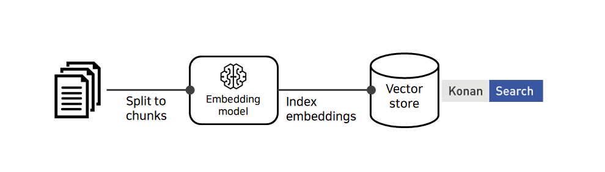
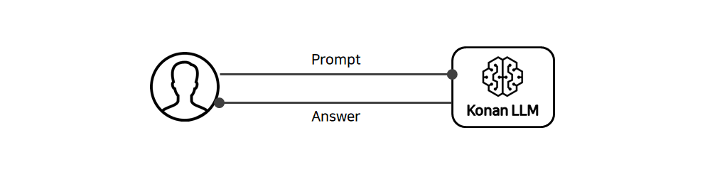

# Chapter 8. 검색증강생성(RAG)

검색증강생성(Retrieval Augumented Generation)은 생성모델에게 검색을 통해 찾은 참조 문서 또는 텍스트를 기반으로 답변을 생성하게 하는 기법입니다.

생성모델의 고질적인 문제인 "환각(hallucination)"을 줄이며 최신 지식을 반영한 답변 생성을 위한 방안으로 많이 이용됩니다.

문서에 대한 접근제어를 검색시스템을 통해 처리함으로써 보안 문제를 해소하는데도 쓰입니다.

## 전체 구성

검색증강을 위한 시스템 구성도는 아래와 같습니다.

**Figure 8.1. 검색증강 시스템 구성도**


## 벡터스토어

벡터스토어는 기존 키워드 검색으로 찾기 어려운 문서들을 검색해내기 위해, 참조 대상 텍스트를 벡터로 변환해서 색인/저장하는 도구입니다. 벡터검색을 지원하는 엔진인 Konan Search를 사용합니다.

**Figure 8.2. 벡터 스토어**



* 참조 대상이 될 문서들은 “임베딩모델(Embedding Model)”을 통해서 벡터 값 형태로 임베딩(embedding)됩니다.
* 임베딩은 문장 단위로 이뤄질 수도 있고, 단락 또는 페이지 단위로 이뤄질 수도 있습니다.
* 임베딩 벡터들은 벡터 색인 엔진 – Konan Search 내 “볼륨” 안에 저장됩니다.
* 저장된 벡터들을 벡터 간 유사도 비교로 검색해 올 수 있습니다.
* 키워드가 정확히 일치하지 않아도 의미상 유사한 것을 찾을 수 있어 재현율(recall)이 올라갑니다.

## 프롬프트를 통한 답변 생성

일반적인 생성모델에 대한 지시는 아래와 같이 참조문서 없이 사용자 프롬프트만을 기반으로 하는 경우가 많습니다. 모델의 지식만으로 답변을 생성하므로 환각현상(hallucination)이 발생할 수 있습니다.

**Figure 8.3. 프롬프트를 통한 답변 생성**



* 생성모델은 기본적으로 사용자 프롬프트를 통해서 답변을 생성합니다.
* 이 프롬프트에 답변의 근거가 되는 문서를 벡터검색을 통해 찾아냅니다.

## 참조 문서를 기반으로 한 답변 생성

벡터스토어를 통해 검색된 문서를 사용자 프롬프트에 함께 전달하여 답변을 생성하게 합니다. 내용 생성에 일조의 "제약"을 가함으로써 환각현상을 줄일 수 있습니다.

**Figure 8.4. 참조 문서를 기반으로 한 답변 생성**


* 사용자의 쿼리를 벡터 임베딩모델을 통해서 벡터로 변환합니다.
* 벡터 검색엔진에서 관련성 높은 문서를 찾아내고, 사용자 질의와 함께 문서를 프롬프트의 컨텍스트로 구성합니다.
* 생성모델에서 최종답변을 생성하고 사용자에게 반환합니다.

## 데이터 흐름 예시

사용자가 질의를 하는 순간부터 생성모델에 답변 요청을 하기까지 아래와 같은 여러 단계의 처리 과정을 거치게 됩니다.

**Figure 8.5. 데이터 흐름 예시**


```
