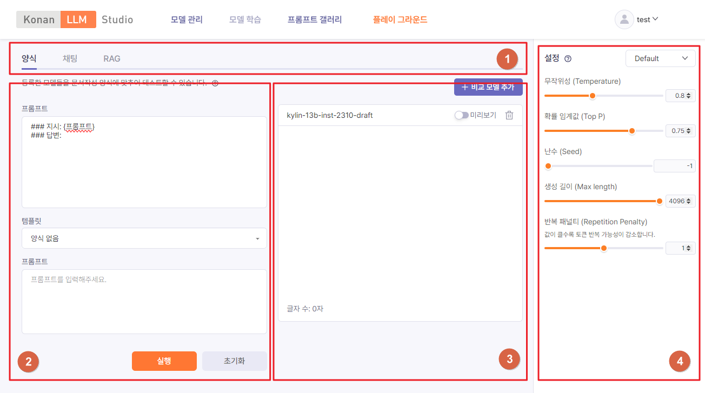

# 플레이 그라운드

플레이 그라운드를 통해 LLM 관련 지식이나 코딩 없이도 언어 모델을 테스트하고 비교해볼 수 있습니다. 파라미터를 설정하고 프롬프트를 입력하여 텍스트를 생성할 수 있는 공간입니다.

## 페이지 구성

플레이 그라운드 페이지는 아래와 같은 영역으로 구성됩니다.

**Figure 6.1. 플레이 그라운드 화면**

1. 모드
   * 프롬프트 입력 모드를 선택합니다.
     * 양식: 자유형식 및 템플리트 기반 프롬프트 입력
     * 채팅: 채팅 형식 프롬프트 입력
     * RAG: RAG 쿼리 프롬프트 입력
2. 프롬프트
   * 언어모델에게 전달할 프롬프트를 입력합니다.
   * [실행] 버튼을 클릭하여 텍스트 생성을 시작합니다.
3. 생성결과
   * 언어모델이 생성한 결과 텍스트를 보여줍니다. [+비교모델추가] 버튼을 클릭하면 결과를 생성할 언어모델을 추가하고 각 모델 별 생성 결과를 비교해 볼 수 있습니다.
4. 파라미터
   * 언어모델에 요청 시 전달되는 설정 값입니다. 자세한 설명은 [Completions API](..\api\completions_all.html#completions_all)를 참조하세요.
